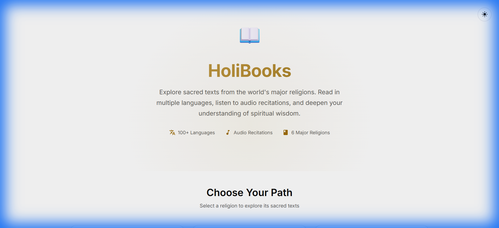
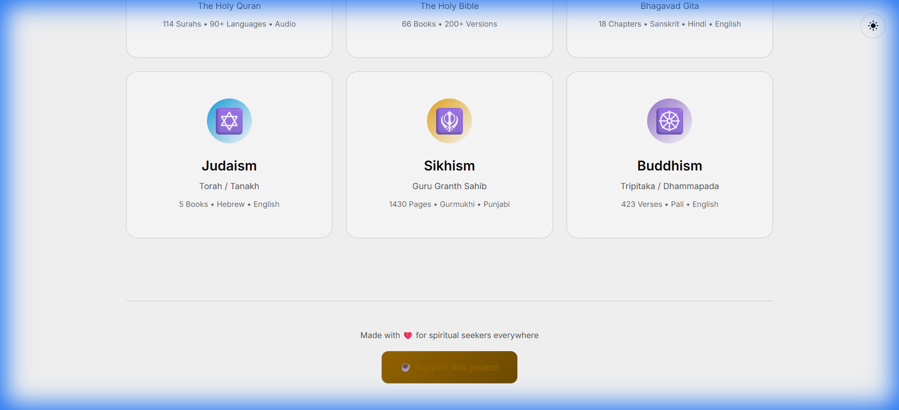
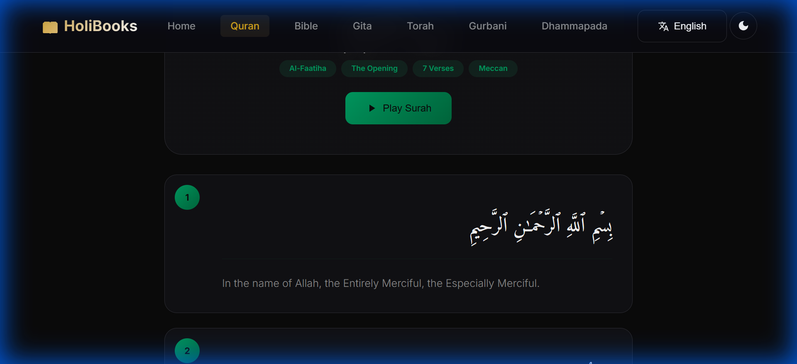

# 📖 HoliBooks

> Explore sacred texts from the world's major religions in one beautiful interface.

[](https://holibooks.vercel.app)
[](https://github.com/ai-dev-2024/HoliBooks)



## ✨ Features

- **6 Sacred Texts** - Quran, Bible, Bhagavad Gita, Torah, Guru Granth Sahib, Dhammapada
- **100+ Languages** - Translations in Arabic, English, Hebrew, Sanskrit, Gurmukhi, Pali & more
- **Audio Recitations** - Listen to Quran recitations by Mishary Alafasy
- **Dark/Light Mode** - Beautiful theming with smooth transitions
- **Offline Fallback** - Sample verses available even when APIs are down
- **Mobile Responsive** - Works perfectly on all devices

## 🌐 Live Demo

**[https://holibooks.vercel.app](https://holibooks.vercel.app)**

## 📸 Screenshots

<table>
<tr>
<td></td>
<td></td>
</tr>
<tr>
<td align="center"><b>Home Page</b></td>
<td align="center"><b>Quran Reader with Audio</b></td>
</tr>
</table>

## 🚀 Quick Start

### Run Locally
```bash
git clone https://github.com/ai-dev-2024/HoliBooks.git
cd HoliBooks
node serve.js
# Open http://localhost:3000
```

### Deploy to Vercel
```bash
npx vercel --prod
```

## 📚 Supported Texts & APIs

| Religion | Sacred Text | API Source | Status |
|----------|-------------|------------|--------|
| ☪️ Islam | Holy Quran | [AlQuran Cloud](https://alquran.cloud) | ✅ Working |
| ✝️ Christianity | Holy Bible | [Bible API (JSDelivr)](https://cdn.jsdelivr.net/gh/wldeh/bible-api) | ✅ Working |
| 🕉️ Hinduism | Bhagavad Gita | [Vedic Scriptures](https://vedicscriptures.github.io) | ✅ Working |
| ✡️ Judaism | Torah | [Bible API (JSDelivr)](https://cdn.jsdelivr.net/gh/wldeh/bible-api) | ✅ Working |
| 🪯 Sikhism | Guru Granth Sahib | [GurbaniNow](https://gurbaninow.com) | ✅ Working |
| ☸️ Buddhism | Dhammapada | Embedded Data | ✅ Working |

### Audio Support
- **Quran Audio**: Mishary Alafasy recitation via [Islamic Network CDN](https://cdn.islamic.network)
- Click the play button on any verse to hear the recitation

## 🛠️ Tech Stack

- **Frontend**: Vanilla HTML, CSS, JavaScript (No frameworks!)
- **Theming**: CSS Variables with oklch colors
- **APIs**: REST APIs for religious texts
- **Hosting**: [Vercel](https://vercel.com)

## 📁 Project Structure

```
HoliBooks/
├── index.html          # Landing page
├── css/global.css      # Global styles
├── js/
│   ├── utils.js        # Shared utilities
│   ├── audio-player.js # Audio player component
│   └── language-selector.js
├── religions/
│   ├── islam/          # Quran reader
│   ├── christianity/   # Bible reader
│   ├── hinduism/       # Bhagavad Gita reader
│   ├── judaism/        # Torah reader
│   ├── sikhism/        # Gurbani reader
│   └── buddhism/       # Dhammapada reader
└── screenshots/        # README images
```

## 💝 Support

If you find this project helpful, consider supporting its development:

[](https://ko-fi.com/ai_dev_2024)

## 📄 License

MIT License - Feel free to use and modify for any purpose.

---

<p align="center">Made with ❤️ for spiritual seekers everywhere</p>
<p align="center">
  <a href="https://holibooks.vercel.app">🌐 Visit HoliBooks</a>
</p>
